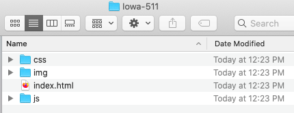
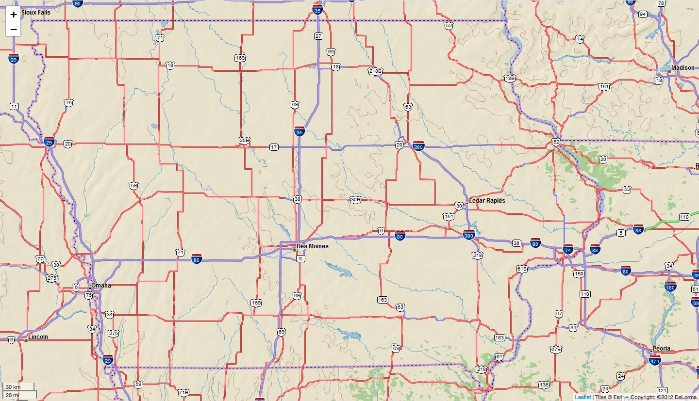
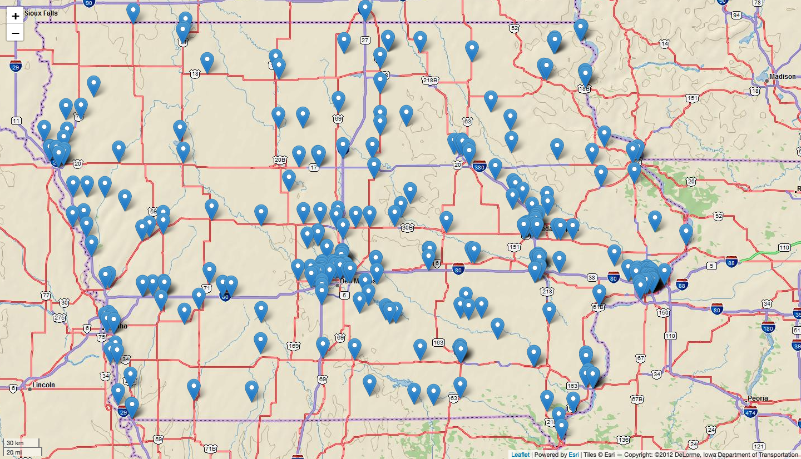
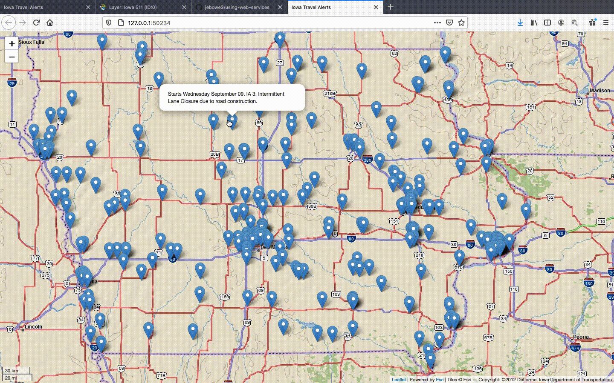
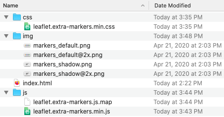
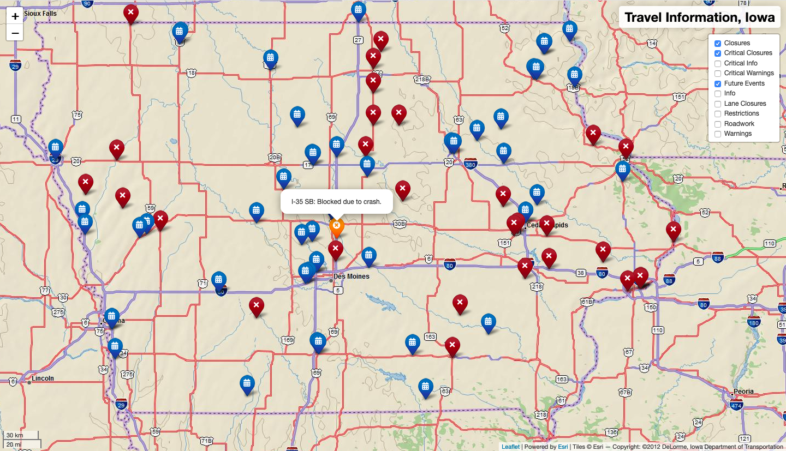

# Using an ArcGIS Feature Service for Web Mapping
While looking around the web for geospatial data, you may have come across ArcGIS servers and were curious how to use these in a web map using Leaflet JavaScript. The following steps document how to use an ArcGIS feature service for web mapping. For this project, we will be using a continuously updated [feature layer](https://services.arcgis.com/8lRhdTsQyJpO52F1/arcgis/rest/services/CARS511_Iowa_View/FeatureServer/0) of traveler information provided by the [Iowa DOT](https://www.511ia.org/). These data can also be found by using the [BTAA Geoportal](https://geo.btaa.org/catalog/5e924db11ba94ce4bda1b38dfe0cdcdf_0). After following the steps below, you should be able to produce a map like the one shown [here](https://jebowe3.github.io/using-web-services/Iowa-511/index.html).

## Step 1: Setting Up Your Project
For this project, you will want a folder containing an index.html file and three subdirectories for the supporting .js files, .css files, and .img files. You can do this manually or more quickly by opening Terminal on your Mac and typing the following command.

```bash
$ cd Desktop && mkdir Iowa-511 && cd Iowa-511 && touch index.html && mkdir {css,js,img}
```

Note that you are beginning with "cd" to change directories to your desktop. Then you are using "mkdir" to make a new folder on your desktop named "Iowa-511". After that, you change directories to the Iowa-511 folder, use "touch" to create an index.html file and "mkdir" to make three subdirectories called "css", "js", and "img". The resulting structure should look like this:

  
**Figure 01.** Initial folder structure

Once you have your project folder created and organized, open the index.html file in the text editor of your choice. I like [Atom](https://atom.io/). Now you are ready to begin building the map.

## Step 2: Initiating the Web Map
In your empty index.html file, cut and paste the following code to create a map centered on Iowa with the Esri DeLorme base map and a scale bar.

```html
<!doctype html>
<html lang="en">
<head>
  <meta charset="utf-8">
  <title>Iowa Travel Alerts</title>
  <!-- load leaflet.css library here -->
  <link rel="stylesheet" href="https://unpkg.com/leaflet@1.6.0/dist/leaflet.css" />
  <!-- add custom css styles here -->
  <style>
    /* style the body of the page here */
    body {
      font-family: sans-serif;
      margin: 0;
      padding: 0;
    }
    /* style the div with an id of "map" here */
    #map {
      position: absolute;
      width: 100%;
      top: 0;
      bottom: 0;
    }
  </style>
</head>
<body>
  <!-- define a div called "map" here -->
  <div id="map"></div>
  <!-- load leaflet.js library here -->
  <script src="https://unpkg.com/leaflet@1.6.0/dist/leaflet.js"></script>
  <!-- javascript here -->
  <script>
    // map options
    const options = {
      center: [42, -93], // center on Iowa
      zoom: 8 // set initial zoom to 8
    }

    // instantiate Leaflet map
    const map = L.map('map', options);

    // use the Esri DeLorme base map
    L.tileLayer('https://server.arcgisonline.com/ArcGIS/rest/services/Specialty/DeLorme_World_Base_Map/MapServer/tile/{z}/{y}/{x}', {
      attribution: 'Tiles &copy; Esri &mdash; Copyright: &copy;2012 DeLorme',
      minZoom: 1,
      maxZoom: 11
    }).addTo(map); // add the base map to the map

    // add a scale bar
    L.control.scale({
      position: 'bottomleft' // position the scale bar at the bottom-left corner
    }).addTo(map);
  </script>
</body>
</html>
```

If you are using atom, you can check your progress with the atom-live-server package. The results of the previous code should look like this:

  
**Figure 02.** Initial map results

You now have a canvas on which to place the Iowa 511 data. However, we need to load another library to access and write the ArcGIS server data to the map. Conveniently, Esri has a library called [Esri Leaflet](https://esri.github.io/esri-leaflet/) for using ArcGIS services with Leaflet. In your index.html file, load this library just below leaflet.js.

```html
<!-- load leaflet.js library here -->
<script src="https://unpkg.com/leaflet@1.6.0/dist/leaflet.js"></script>
<!-- load Esri Leaflet from CDN -->
<script src="https://unpkg.com/esri-leaflet@2.5.0/dist/esri-leaflet.js" integrity="sha512-ucw7Grpc+iEQZa711gcjgMBnmd9qju1CICsRaryvX7HJklK0pGl/prxKvtHwpgm5ZHdvAil7YPxI1oWPOWK3UQ==" crossorigin=""></script>
```

Now, we can locate and load the Iowa 511 data.

## Step 3: Locating and Loading the Data
Within the script tags containing your custom map JavaScript in your index.html file, insert the following code just after the code that adds the scale bar.

```javascript
// add a scale bar
L.control.scale({
  position: 'bottomleft' // position the scale bar at the bottom-left corner
}).addTo(map);

// add 511 points
L.esri.featureLayer({
  // web feature service url
  url: /* insert web feature service url here */,
  // pointToLayer
  pointToLayer: function(feature, latlng) {
    return L.marker(latlng); // return a marker for every data point
  } // end pointToLayer
}).addTo(map); // end layer
```

Notice that there is a place to add the url of the server providing your data. We need to find the link for the data and paste it there.

You can find an enormous amount of geospatial data at the [Big Ten Academic Alliance Geoportal](https://geo.btaa.org/). Here, you can search for themes of interest and filter the results in many different ways, including by type, if you are interested in only the results containing the "service" tag. For this activity, I am using the ArcGIS feature layer entitled ["Traveler Information Events 511: Iowa"](https://geo.btaa.org/catalog/5e924db11ba94ce4bda1b38dfe0cdcdf_0). If you navigate to this page, you will see various options. Click ["Web services"](https://services.arcgis.com/8lRhdTsQyJpO52F1/arcgis/rest/services/CARS511_Iowa_View/FeatureServer/0) and copy the link. Now, paste this link into the code that loads the Esri feature. Make sure to place the link within quotes.

```javascript
// add 511 points
L.esri.featureLayer({
  // web feature service url
  url: 'https://services.arcgis.com/8lRhdTsQyJpO52F1/arcgis/rest/services/CARS511_Iowa_View/FeatureServer/0',
  // pointToLayer
  pointToLayer: function(feature, latlng) {
    return L.marker(latlng); // return a marker for every data point
  } // end pointToLayer
}).addTo(map); // end layer
```

If you check your map in live server, you should see something like this:

  
**Figure 03.** Initial data load

Now that we have loaded the data, let's add some interaction so that we can see more detail about each point. If you copy and paste the [url](https://services.arcgis.com/8lRhdTsQyJpO52F1/arcgis/rest/services/CARS511_Iowa_View/FeatureServer/0) for the service in your browser, you can scroll through all of the metadata for the points. For our purposes, the information under "Fields" and "Types" is most important. Notice that there are fields entitled "STYLE", "headline", and "cause". First, we will use the headline and cause fields to populate an informative popup for each point. Update the feature layer script with the onEachFeature option as follows.

```javascript
// add 511 points
L.esri.featureLayer({
  // web feature service url
  url: 'https://services.arcgis.com/8lRhdTsQyJpO52F1/arcgis/rest/services/CARS511_Iowa_View/FeatureServer/0',
  // pointToLayer
  pointToLayer: function(feature, latlng) {
    return L.marker(latlng); // return a marker for every data point
  }, // end pointToLayer
  // On each marker...
  onEachFeature: function(feature, layer) {
    // define the layer feature properties
    let props = layer.feature.properties;
    // bind info to the layer features using popups
    layer.bindPopup(props.headline + " " + props.cause, {
      closeButton: false
    });
    layer.on('mouseover', function() {
      layer.openPopup();
    });
    layer.on('mouseout', function() {
      layer.closePopup();
    });
  } // end onEachFeature
}).addTo(map); // end layer
```

Notice that we have defined the properties of each layer feature with "let props = layer.feature.properties". We then binded a popup to the layer markers including both the headline and cause properties (props.headline and props.cause). Finally, we included some code to open the popup when the user hovers over the marker with their mouse and to close the popup when their mouse pointer leaves the marker.

  
**Figure 04.** Initial popup content

You now have the basis of an interactive map using the Iowa DOT's updating 511 information. However, you may want to remove null information from the popup when the cause of the warning is undefined. Update your feature layer code with the following inside the onEachFeature option. Notice that we are using conditional logic to define a new variable called "cause".

```javascript
// add 511 points
L.esri.featureLayer({
  // web feature service url
  url: 'https://services.arcgis.com/8lRhdTsQyJpO52F1/arcgis/rest/services/CARS511_Iowa_View/FeatureServer/0',
  // pointToLayer
  pointToLayer: function(feature, latlng) {
    return L.marker(latlng); // return a marker for every data point
  }, // end pointToLayer
  // On each marker...
  onEachFeature: function(feature, layer) {
    // define the layer feature properties
    let props = layer.feature.properties;
    // conditionally format "cause" property to disappear if null
    if (props.cause == null) {
      var cause = ''
    } else {
      var cause = props.cause
    }
    // bind info to the layer features using popups
    layer.bindPopup(props.headline + " " + cause, {
      closeButton: false
    });
    layer.on('mouseover', function() {
      layer.openPopup();
    });
    layer.on('mouseout', function() {
      layer.closePopup();
    });
  } // end onEachFeature
}).addTo(map); // end layer
```    

Also, you may have noticed from the "STYLE" field that there are ten different classifications of 511 warnings. It would be nice to separate these into individually symbolized layers that you can filter with a control. This will require a leaflet plugin called [extra-markers](https://github.com/coryasilva/Leaflet.ExtraMarkers) with [Font Awesome](https://fontawesome.com/icons?d=gallery) icons.

## Step 4: Styling with Extra Markers
First, copy the css file in this [folder](https://github.com/coryasilva/Leaflet.ExtraMarkers/tree/master/dist/css) into a file in your css folder called "leaflet.extra-markers.min.css". Next, copy the "leaflet.extra-markers.js.map" and "leaflet.extra-markers.min.js" files from this [folder](https://github.com/coryasilva/Leaflet.ExtraMarkers/tree/master/dist/js) into your js folder. Finally, copy the png files from this [folder](https://github.com/coryasilva/Leaflet.ExtraMarkers/tree/master/dist/img) to your img folder. Your folder structure should look like this:

  
**Figure 05.** Extra markers files

Now that you have all of the files required for the new markers, you can add this content to your index.html file. Just below where you loaded the leaflet.css library, add the css files necessary for the markers.

```html
<!-- load leaflet.css library here -->
<link rel="stylesheet" href="https://unpkg.com/leaflet@1.6.0/dist/leaflet.css" />
<!--for icon support-->
<link rel="stylesheet" href="https://maxcdn.bootstrapcdn.com/font-awesome/4.7.0/css/font-awesome.min.css">
<link rel="stylesheet" href="https://use.fontawesome.com/releases/v5.14.0/css/all.css">
<link rel="stylesheet" href="https://use.fontawesome.com/releases/v5.14.0/css/v4-shims.css">
<!-- for icon markers -->
<link rel="stylesheet" href="css/leaflet.extra-markers.min.css">
```

Then, just below where you added the Esri Leaflet library, add the path to the "extra-markers.min.js" file.

```html
<script src="https://unpkg.com/leaflet@1.6.0/dist/leaflet.js"></script>
<!-- Load Esri Leaflet from CDN -->
<script src="https://unpkg.com/esri-leaflet@2.5.0/dist/esri-leaflet.js" integrity="sha512-ucw7Grpc+iEQZa711gcjgMBnmd9qju1CICsRaryvX7HJklK0pGl/prxKvtHwpgm5ZHdvAil7YPxI1oWPOWK3UQ==" crossorigin=""></script>
<!-- for icon markers -->
<script src="js/leaflet.extra-markers.min.js"></script>
```

Now you can use some markers with Font Awesome icons. Let's update the feature layer to filter out the road closures in the data. Change that code to the following:

```javascript
// closure layer
const closure = L.esri.featureLayer({
  // web feature service url
  url: 'https://services.arcgis.com/8lRhdTsQyJpO52F1/arcgis/rest/services/CARS511_Iowa_View/FeatureServer/0',
  // pointToLayer
  pointToLayer: function(feature, latlng) {
    // If the STYLE property equals "closure"...
    if (feature.properties.STYLE == "closure") {
      // ...return an extra marker styled with a Font Awesome icon called 'fa fa-times'
      return L.marker(latlng, {
        icon: L.ExtraMarkers.icon({
          icon: 'fa fa-times',
          prefix: 'fa',
          markerColor: 'red', // give the marker a color
          iconColor: 'white' // give the icon in the marker a color
        })
      });
    };
  }, // end pointToLayer
  // On each marker...
  onEachFeature: function(feature, layer) {
    // define the layer feature properties
    let props = layer.feature.properties;
    // conditionally format "cause" property to disappear if null
    if (props.cause == null) {
      var cause = ''
    } else {
      var cause = props.cause
    }
    // bind info to the layer features using popups
    layer.bindPopup(props.headline + " " + cause, {
      closeButton: false
    });
    layer.on('mouseover', function() {
      layer.openPopup();
    });
    layer.on('mouseout', function() {
      layer.closePopup();
    });
  } // end onEachFeature
}); // end closure layer
```

Notice that we have not added the layer to the map. That is because we want to allow the user to control the layers with a layer control. After the feature layer code above, paste the following code to add the layer control to your map.

```javascript
// define overlays for the layer control
var overlays = {
  "Closures": closure
};

// assemble the layer control and add it to the map
L.control.layers(null, overlays, {
  collapsed: false,
}).addTo(map);
```

With this, you should be able to add and remove all of the road closure points from your map. However, the other points are missing. Therefore, you need to iterate over all ten possibilities for the "STYLE" property and define layers for each of them using the code above as your template.

Finally, the map needs a title. Scroll to the top of your index.html document where you have your custom css code and add some css for .ctl and .title so that the code between the style tags is as follows:

```css
/* style the body of the page here */
body {
  font-family: sans-serif;
  margin: 0;
  padding: 0;
}

/* style the div with an id of "map" here */
#map {
  position: absolute;
  width: 100%;
  top: 0;
  bottom: 0;
}

/* full size */
.ctl {
  padding: 2px 10px 2px 10px;
  background: white;
  background: rgba(255, 255, 255, 0.9);
  box-shadow: 0 0 15px rgba(0, 0, 0, 0.2);
  border-radius: 5px;
  text-align: right;
}

.title {
  font-size: 18pt;
  font-weight: bold;
}
```

Finally, add the following JavaScript code between the code adding the base map to the map and that which adds the scale bar to the map.

```javascript
// Title
var title = L.control();
title.onAdd = function(map) {
  this._div = L.DomUtil.create('div', 'ctl title');
  this.update();
  return this._div;
};
title.update = function(props) {
  this._div.innerHTML = "Travel Information, Iowa";
};
title.addTo(map);
```

The final result should look something like this:

  
**Figure 06.** Final map

If something went wrong, no worries! You can follow the final code for the index.html here:

```html
<!doctype html>
<html lang="en">

<head>
  <meta charset="utf-8">
  <title>Iowa Travel Alerts</title>
  <!-- load leaflet.css library here -->
  <link rel="stylesheet" href="https://unpkg.com/leaflet@1.6.0/dist/leaflet.css" />
  <!--for icon support-->
  <link rel="stylesheet" href="https://maxcdn.bootstrapcdn.com/font-awesome/4.7.0/css/font-awesome.min.css">
  <link rel="stylesheet" href="https://use.fontawesome.com/releases/v5.14.0/css/all.css">
  <link rel="stylesheet" href="https://use.fontawesome.com/releases/v5.14.0/css/v4-shims.css">
  <!-- for icon markers -->
  <link rel="stylesheet" href="css/leaflet.extra-markers.min.css">
  <!-- add custom css styles here -->
  <style>
    /* style the body of the page here */
    body {
      font-family: sans-serif;
      margin: 0;
      padding: 0;
    }

    /* style the div with an id of "map" here */
    #map {
      position: absolute;
      width: 100%;
      top: 0;
      bottom: 0;
    }

    /* full size */
    .ctl {
      padding: 2px 10px 2px 10px;
      background: white;
      background: rgba(255, 255, 255, 0.9);
      box-shadow: 0 0 15px rgba(0, 0, 0, 0.2);
      border-radius: 5px;
      text-align: right;
    }

    .title {
      font-size: 18pt;
      font-weight: bold;
    }
  </style>
</head>

<body>
  <!-- define a div called "map" here -->
  <div id="map"></div>
  <!-- load leaflet.js library here -->
  <script src="https://unpkg.com/leaflet@1.6.0/dist/leaflet.js"></script>
  <!-- load Esri Leaflet from CDN -->
  <script src="https://unpkg.com/esri-leaflet@2.5.0/dist/esri-leaflet.js" integrity="sha512-ucw7Grpc+iEQZa711gcjgMBnmd9qju1CICsRaryvX7HJklK0pGl/prxKvtHwpgm5ZHdvAil7YPxI1oWPOWK3UQ==" crossorigin=""></script>
  <!-- for icon markers -->
  <script src="js/leaflet.extra-markers.min.js"></script>
  <!-- javascript here -->
  <script>
    // map options
    const options = {
      center: [42, -93], // center on Iowa
      zoom: 8 // set initial zoom to 8
    }

    // instantiate Leaflet map
    const map = L.map('map', options);

    // use the Esri DeLorme base map
    L.tileLayer('https://server.arcgisonline.com/ArcGIS/rest/services/Specialty/DeLorme_World_Base_Map/MapServer/tile/{z}/{y}/{x}', {
      attribution: 'Tiles &copy; Esri &mdash; Copyright: &copy;2012 DeLorme',
      minZoom: 1,
      maxZoom: 11
    }).addTo(map); // add the base map to the map

    // Title
    var title = L.control();
    title.onAdd = function(map) {
      this._div = L.DomUtil.create('div', 'ctl title');
      this.update();
      return this._div;
    };
    title.update = function(props) {
      this._div.innerHTML = "Travel Information, Iowa";
    };
    title.addTo(map);

    // add a scale bar
    L.control.scale({
      position: 'bottomleft' // position the scale bar at the bottom-left corner
    }).addTo(map);

    // closure layer
    const closure = L.esri.featureLayer({
      // web feature service url
      url: 'https://services.arcgis.com/8lRhdTsQyJpO52F1/arcgis/rest/services/CARS511_Iowa_View/FeatureServer/0',
      // pointToLayer
      pointToLayer: function(feature, latlng) {
        // If the STYLE property equals "closure"...
        if (feature.properties.STYLE == "closure") {
          // ...return an extra marker styled with a Font Awesome icon called 'fa fa-times'
          return L.marker(latlng, {
            icon: L.ExtraMarkers.icon({
              icon: 'fa fa-times',
              prefix: 'fa',
              markerColor: 'red', // give the marker a color
              iconColor: 'white' // give the icon in the marker a color
            })
          });
        };
      }, // end pointToLayer
      // On each marker...
      onEachFeature: function(feature, layer) {
        // define the layer feature properties
        let props = layer.feature.properties;
        // conditionally format "cause" property to disappear if null
        if (props.cause == null) {
          var cause = ''
        } else {
          var cause = props.cause
        }
        // bind info to the layer features using popups
        layer.bindPopup(props.headline + " " + cause, {
          closeButton: false
        });
        layer.on('mouseover', function() {
          layer.openPopup();
        });
        layer.on('mouseout', function() {
          layer.closePopup();
        });
      } // end onEachFeature
    }); // end closure layer

    // futureEvent layer
    const futureEvent = L.esri.featureLayer({
      // web feature service url
      url: 'https://services.arcgis.com/8lRhdTsQyJpO52F1/arcgis/rest/services/CARS511_Iowa_View/FeatureServer/0',
      // pointToLayer
      pointToLayer: function(feature, latlng) {
        if (feature.properties.STYLE == "future_event") {
          return L.marker(latlng, {
            icon: L.ExtraMarkers.icon({
              icon: 'fa fa-calendar',
              prefix: 'fa',
              markerColor: 'blue',
              iconColor: 'white'
            })
          });
        };
      }, // end pointToLayer
      // On each marker...
      onEachFeature: function(feature, layer) {
        // define the layer feature properties
        let props = layer.feature.properties;
        // conditionally format "cause" property to disappear if null
        if (props.cause == null) {
          var cause = ''
        } else {
          var cause = props.cause
        }
        // bind info to the layer features using popups
        layer.bindPopup(props.headline + " " + cause, {
          closeButton: false
        });
        layer.on('mouseover', function() {
          layer.openPopup();
        });
        layer.on('mouseout', function() {
          layer.closePopup();
        });
      } // end onEachFeature
    }); // end futureEvent layer

    // laneClosure layer
    const laneClosure = L.esri.featureLayer({
      // web feature service url
      url: 'https://services.arcgis.com/8lRhdTsQyJpO52F1/arcgis/rest/services/CARS511_Iowa_View/FeatureServer/0',
      // pointToLayer
      pointToLayer: function(feature, latlng) {
        if (feature.properties.STYLE == "lane_closure") {
          return L.marker(latlng, {
            icon: L.ExtraMarkers.icon({
              icon: 'fa fa-window-close-o',
              prefix: 'fa',
              markerColor: 'green',
              iconColor: 'white'
            })
          });
        };
      }, // end pointToLayer
      // On each marker...
      onEachFeature: function(feature, layer) {
        // define the layer feature properties
        let props = layer.feature.properties;
        // conditionally format "cause" property to disappear if null
        if (props.cause == null) {
          var cause = ''
        } else {
          var cause = props.cause
        }
        // bind info to the layer features using popups
        layer.bindPopup(props.headline + " " + cause, {
          closeButton: false
        });
        layer.on('mouseover', function() {
          layer.openPopup();
        });
        layer.on('mouseout', function() {
          layer.closePopup();
        });
      } // end onEachFeature
    }); // end laneClosure layer

    // criticalClosure layer
    const criticalClosure = L.esri.featureLayer({
      // web feature service url
      url: 'https://services.arcgis.com/8lRhdTsQyJpO52F1/arcgis/rest/services/CARS511_Iowa_View/FeatureServer/0',
      // pointToLayer
      pointToLayer: function(feature, latlng) {
        if (feature.properties.STYLE == "priority_closure") {
          return L.marker(latlng, {
            icon: L.ExtraMarkers.icon({
              icon: 'fa fa-times-circle',
              prefix: 'fa',
              markerColor: 'orange',
              iconColor: 'white'
            })
          });
        };
      }, // end pointToLayer
      // On each marker...
      onEachFeature: function(feature, layer) {
        // define the layer feature properties
        let props = layer.feature.properties;
        // conditionally format "cause" property to disappear if null
        if (props.cause == null) {
          var cause = ''
        } else {
          var cause = props.cause
        }
        // bind info to the layer features using popups
        layer.bindPopup(props.headline + " " + cause, {
          closeButton: false
        });
        layer.on('mouseover', function() {
          layer.openPopup();
        });
        layer.on('mouseout', function() {
          layer.closePopup();
        });
      } // end onEachFeature
    }); // end criticalClosure layer

    // criticalInfo layer
    const criticalInfo = L.esri.featureLayer({
      // web feature service url
      url: 'https://services.arcgis.com/8lRhdTsQyJpO52F1/arcgis/rest/services/CARS511_Iowa_View/FeatureServer/0',
      // pointToLayer
      pointToLayer: function(feature, latlng) {
        if (feature.properties.STYLE == "priority_info") {
          return L.marker(latlng, {
            icon: L.ExtraMarkers.icon({
              icon: 'fa fa-info-circle',
              prefix: 'fa',
              markerColor: 'yellow',
              iconColor: 'white'
            })
          });
        };
      }, // end pointToLayer
      // On each marker...
      onEachFeature: function(feature, layer) {
        // define the layer feature properties
        let props = layer.feature.properties;
        // conditionally format "cause" property to disappear if null
        if (props.cause == null) {
          var cause = ''
        } else {
          var cause = props.cause
        }
        // bind info to the layer features using popups
        layer.bindPopup(props.headline + " " + cause, {
          closeButton: false
        });
        layer.on('mouseover', function() {
          layer.openPopup();
        });
        layer.on('mouseout', function() {
          layer.closePopup();
        });
      } // end onEachFeature
    }); // end criticalInfo layer

    // restriction layer
    const restriction = L.esri.featureLayer({
      // web feature service url
      url: 'https://services.arcgis.com/8lRhdTsQyJpO52F1/arcgis/rest/services/CARS511_Iowa_View/FeatureServer/0',
      // pointToLayer
      pointToLayer: function(feature, latlng) {
        if (feature.properties.STYLE == "restriction") {
          return L.marker(latlng, {
            icon: L.ExtraMarkers.icon({
              icon: 'fa fa-lock',
              prefix: 'fa',
              markerColor: 'purple',
              iconColor: 'white'
            })
          });
        };
      }, // end pointToLayer
      // On each marker...
      onEachFeature: function(feature, layer) {
        // define the layer feature properties
        let props = layer.feature.properties;
        // conditionally format "cause" property to disappear if null
        if (props.cause == null) {
          var cause = ''
        } else {
          var cause = props.cause
        }
        // bind info to the layer features using popups
        layer.bindPopup(props.headline + " " + cause, {
          closeButton: false
        });
        layer.on('mouseover', function() {
          layer.openPopup();
        });
        layer.on('mouseout', function() {
          layer.closePopup();
        });
      } // end onEachFeature
    }); // end restriction layer

    // roadwork layer
    const roadwork = L.esri.featureLayer({
      // web feature service url
      url: 'https://services.arcgis.com/8lRhdTsQyJpO52F1/arcgis/rest/services/CARS511_Iowa_View/FeatureServer/0',
      // pointToLayer
      pointToLayer: function(feature, latlng) {
        if (feature.properties.STYLE == "roadwork") {
          return L.marker(latlng, {
            icon: L.ExtraMarkers.icon({
              icon: 'fa fa-road',
              prefix: 'fa',
              markerColor: 'violet',
              iconColor: 'white'
            })
          });
        };
      }, // end pointToLayer
      // On each marker...
      onEachFeature: function(feature, layer) {
        // define the layer feature properties
        let props = layer.feature.properties;
        // conditionally format "cause" property to disappear if null
        if (props.cause == null) {
          var cause = ''
        } else {
          var cause = props.cause
        }
        // bind info to the layer features using popups
        layer.bindPopup(props.headline + " " + cause, {
          closeButton: false
        });
        layer.on('mouseover', function() {
          layer.openPopup();
        });
        layer.on('mouseout', function() {
          layer.closePopup();
        });
      } // end onEachFeature
    }); // end roadwork layer

    // warning layer
    const warning = L.esri.featureLayer({
      // web feature service url
      url: 'https://services.arcgis.com/8lRhdTsQyJpO52F1/arcgis/rest/services/CARS511_Iowa_View/FeatureServer/0',
      // pointToLayer
      pointToLayer: function(feature, latlng) {
        if (feature.properties.STYLE == "warning") {
          return L.marker(latlng, {
            icon: L.ExtraMarkers.icon({
              icon: 'fa fa-exclamation',
              prefix: 'fa',
              markerColor: 'cyan',
              iconColor: 'white'
            })
          });
        };
      }, // end pointToLayer
      // On each marker...
      onEachFeature: function(feature, layer) {
        // define the layer feature properties
        let props = layer.feature.properties;
        // conditionally format "cause" property to disappear if null
        if (props.cause == null) {
          var cause = ''
        } else {
          var cause = props.cause
        }
        // bind info to the layer features using popups
        layer.bindPopup(props.headline + " " + cause, {
          closeButton: false
        });
        layer.on('mouseover', function() {
          layer.openPopup();
        });
        layer.on('mouseout', function() {
          layer.closePopup();
        });
      } // end onEachFeature
    }); // end warning layer

    // criticalWarning layer
    const criticalWarning = L.esri.featureLayer({
      // web feature service url
      url: 'https://services.arcgis.com/8lRhdTsQyJpO52F1/arcgis/rest/services/CARS511_Iowa_View/FeatureServer/0',
      // pointToLayer
      pointToLayer: function(feature, latlng) {
        if (feature.properties.STYLE == "priority_warning") {
          return L.marker(latlng, {
            icon: L.ExtraMarkers.icon({
              icon: 'fa fa-exclamation-triangle',
              prefix: 'fa',
              markerColor: 'orange-dark',
              iconColor: 'white'
            })
          });
        };
      }, // end pointToLayer
      // On each marker...
      onEachFeature: function(feature, layer) {
        // define the layer feature properties
        let props = layer.feature.properties;
        // conditionally format "cause" property to disappear if null
        if (props.cause == null) {
          var cause = ''
        } else {
          var cause = props.cause
        }
        // bind info to the layer features using popups
        layer.bindPopup(props.headline + " " + cause, {
          closeButton: false
        });
        layer.on('mouseover', function() {
          layer.openPopup();
        });
        layer.on('mouseout', function() {
          layer.closePopup();
        });
      } // end onEachFeature
    }); // end criticalWarning layer

    // info layer
    const info = L.esri.featureLayer({
      // web feature service url
      url: 'https://services.arcgis.com/8lRhdTsQyJpO52F1/arcgis/rest/services/CARS511_Iowa_View/FeatureServer/0',
      // pointToLayer
      pointToLayer: function(feature, latlng) {
        if (feature.properties.STYLE == "info") {
          return L.marker(latlng, {
            icon: L.ExtraMarkers.icon({
              icon: 'fa fa-info',
              prefix: 'fa',
              markerColor: 'green-dark',
              iconColor: 'white'
            })
          });
        };
      }, // end pointToLayer
      // On each marker...
      onEachFeature: function(feature, layer) {
        // define the layer feature properties
        let props = layer.feature.properties;
        // conditionally format "cause" property to disappear if null
        if (props.cause == null) {
          var cause = ''
        } else {
          var cause = props.cause
        }
        // bind info to the layer features using popups
        layer.bindPopup(props.headline + " " + cause, {
          closeButton: false
        });
        layer.on('mouseover', function() {
          layer.openPopup();
        });
        layer.on('mouseout', function() {
          layer.closePopup();
        });
      } // end onEachFeature
    }); // end info layer

    // define overlays for the layer control
    var overlays = {
      "Closures": closure,
      "Critical Closures": criticalClosure,
      "Critical Info": criticalInfo,
      "Critical Warnings": criticalWarning,
      "Future Events": futureEvent,
      "Info": info,
      "Lane Closures": laneClosure,
      "Restrictions": restriction,
      "Roadwork": roadwork,
      "Warnings": warning
    };

    // assemble the layer control and add it to the map
    L.control.layers(null, overlays, {
      collapsed: false,
    }).addTo(map);
  </script>
</body>

</html>
```

The final map can be see [here](https://jebowe3.github.io/using-web-services/Iowa-511/index.html).
